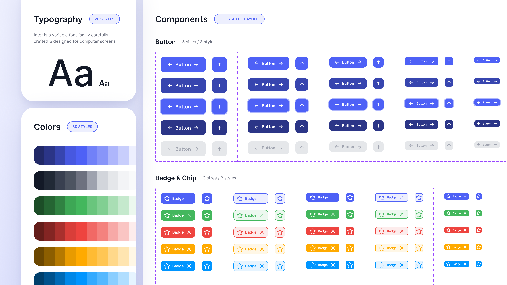
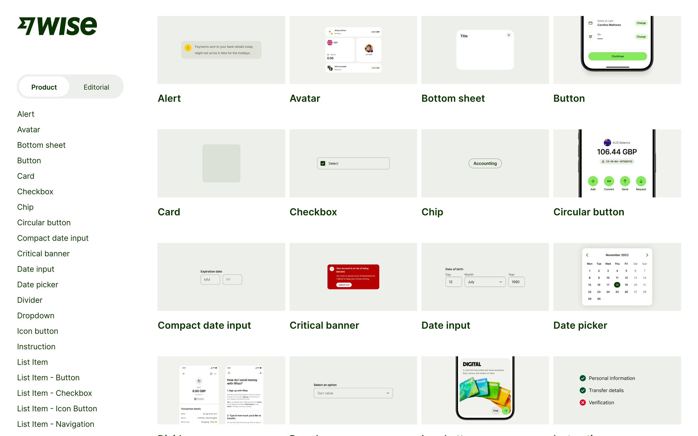
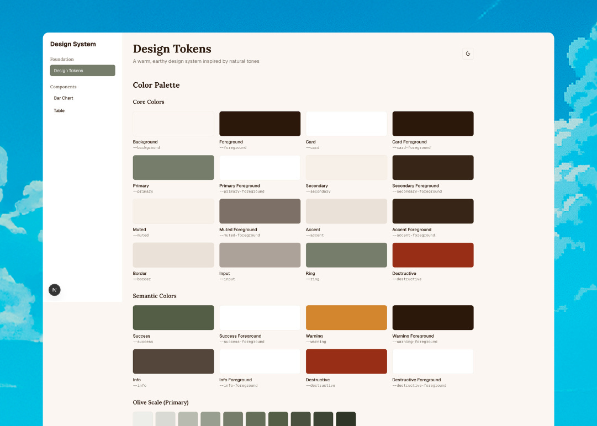
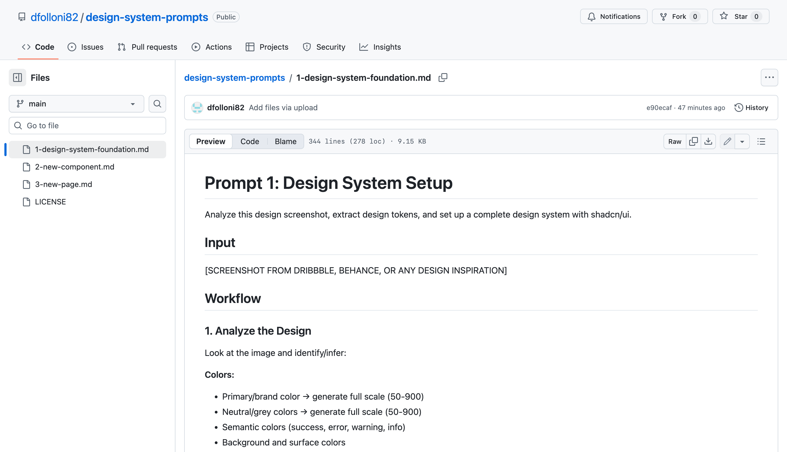
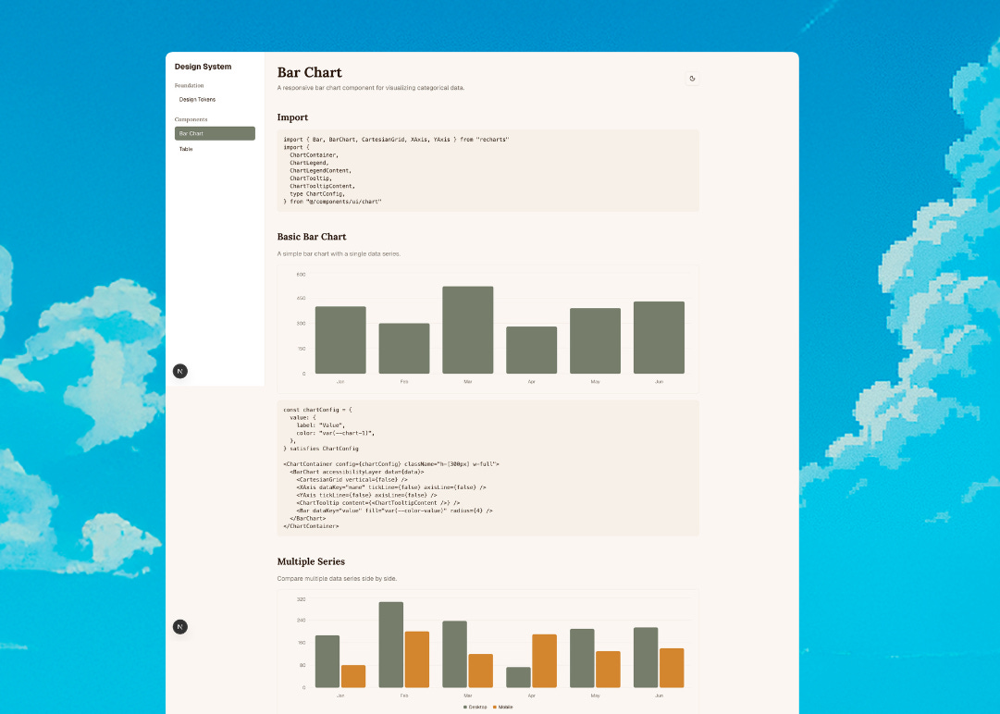
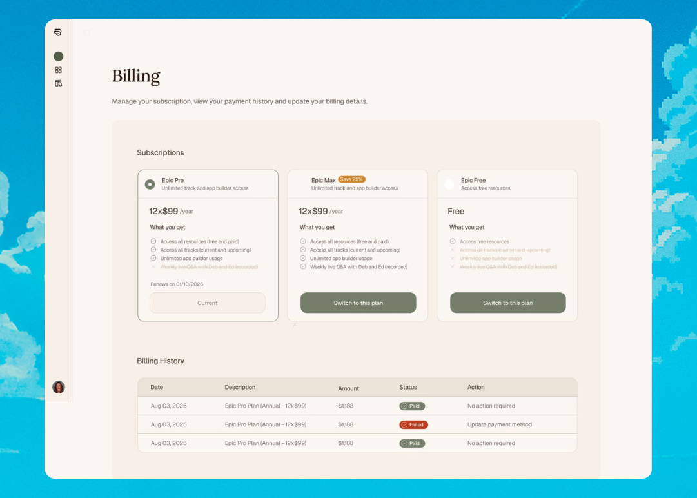
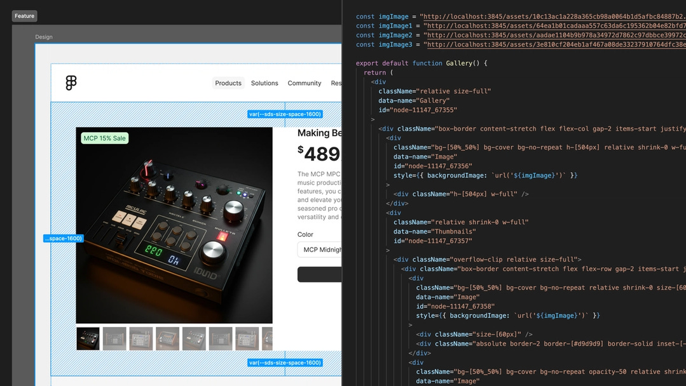

# Como criar um Design System com o Claude Code + Figma

#### Essa é a técnica de 3 prompts que uso para criar design systems profissionais em tempo recorde, sem precisar ser bom de design ou saber programar.

Nada deixa uma aplicação com mais cara de amadora do que falta de consistência no design.

Eu já vi inúmeros projetos, que até pareciam interessantes, mas aí, em cada página tem um botão diferentes, as cores não batem, o spacing tá todo errado... e seu app fica com aquela carinha de “feito de qualquer jeito” (aka: vibe coded).

Pois é. Você precisa de um design system. O design system é como o single source of truth de todos os seus componentes, cores, tipografia, espaçamento, bordas, etc.

> Design System | Figma

Com ele, você não só vai deixar o seu design mais consistente, mas também aumentar radicalmente a sua produtividade - porque você vai gastar menos tempo recriando componentes que potencialmente já existam.

Historicamente, design system significava MUITO TRABALHO. Você precisava de um dev frontend e de um designer muito disposto para fazer algo profissional - recursos que eu sei que a maioria de vocês não tem.

Mas a boa notícia é que agora dá pra criar um design system profissional com muito menos esforço do que você imagina. E pra provar isso, eu construí um do zero em menos de 30 minutos usando apenas 3 prompts no Claude Code e Figma.

E na edição de hoje vou mostrar exatamente como você pode fazer isso também.

## Por que você precisa de um design system?

Antes de entrar nos prompts, deixa eu te convencer do porquê isso vai mudar sua vida como builder:

**1. Consistência visual automática**

Quando você tem um design system, todos os componentes do seu app seguem o mesmo padrão. Botões com o mesmo estilo, cores padronizadas, espaçamentos consistentes. Isso deixa sua aplicação com uma cara MUITO mais profissional.

**2. Mais produtividade**

Você não vai mais ficar recriando o mesmo botão, o mesmo card, a mesma tabela 15 vezes em páginas diferentes. Criou uma vez no design system? É só importar e usar. Simples assim.

**3. Economia de tokens**

Se você usa coding assistants (e deveria), ter um design system evita que a IA fique criando componentes do zero toda hora. Ela importa do seu design system e pronto. Menos tokens gastos, implementações mais rápidas.

> Design System | Wise

## A técnica dos 3 prompts

O processo que eu uso é bem direto:

1. **Prompt 1**: Extrair as variáveis de estilo e criar a fundação do design system

2. **Prompt 2**: Adicionar componentes específicos ao design system

3. **Prompt 3**: Usar os componentes do design system nas páginas do projeto

Vou explicar cada um em detalhes.

# Setup inicial: O que você precisa ter

Antes de começar, você precisa de:

- Claude Code (a extensão do Claude no VS Code - se você ainda não usa, instala porque vale MUITO a pena)

- Projeto NextJS com Shadcn e Tailwind instalados

- MCP do Shadcn instalado (vou mostrar como)

- MCP do Figma instalado (opcional - você pode usar screenshots)

A propósito: pra quem não conhece o Shadcn: é uma biblioteca com vários componentes prontos e super útil pra produtividade. Eu indico ele em basicamente todos os meus vídeos porque realmente faz diferença. E o Tailwind é um framework de estilo que permite customizar esses componentes com muito mais facilidade, sem ter que fazer CSS do zero.

# Prompt 1: Criando a fundação do design system

> Design Tokens criados com o Prompt 1

O primeiro prompt é o mais importante porque ele estabelece a base de tudo.

O que esse prompt faz:

1. Recebe uma referência visual sua (pode ser um design do Figma ou até um print do Pinterest)

2. Extrai as variáveis de estilo dessa referência: cores, tipografia, spacing, border radius, sombras...

3. Inicializa o Shadcn no projeto

4. Cria o arquivo Global CSS com todas essas variáveis

5. Instala componentes básicos (botões, badges, cards, alerts)

6. Cria a página /style-guides com toda a documentação visual do design system

**Importante**: Não precisa ser perfeito. Se você não tem um projeto no Figma, pode simplesmente ir no Pinterest, buscar “design system”, escolher um que você goste e usar como referência. O prompt vai extrair a inspiração de estilo dali.

A ideia não é copiar, mas usar aquilo como referência pra você construir o seu próprio sistema.

🔗 [Acesse o Prompt 1 clicando aqui](./1-design-system-foundation.md)

> Design System Prompts | Github @di-ferreira - [Acesse aqui!](https://github.com/di-ferreira/design-system-prompts)

Quando você roda esse prompt, o Claude vai:

- Analisar seu screenshot/Figma

- Criar toda a paleta de cores (com versões light e dark)

- Definir tipografia para headings e body text

- Estabelecer regras de espaçamento e bordas

- Montar os primeiros componentes do seu design system

E o melhor: ele já deixa tudo organizado numa página /style-guides onde você consegue ver todos os seus design tokens e componentes de forma visual.

# Prompt 2: Adicionando componentes ao design system

> Componentes criados com o Prompt 2

Agora que você tem a fundação pronta, é hora de estender seu design system com componentes mais específicos.

**Antes de usar esse prompt**: você precisa instalar o MCP do Shadcn. É super simples:

- Vai na página do MCP do Shadcn

- Copia o comando de instalação do Claude Code

- Cola no terminal dentro da pasta do seu projeto

- Reinicia o Claude Code (importante!)

Agora sim, você pode usar o Prompt 2.

Esse prompt funciona assim:

1. Você diz qual componente quer adicionar (ex: “table”, “bar chart”)

2. Ele usa o MCP do Shadcn pra buscar esse componente e ver exemplos de uso

3. Ele instala o componente com as customizações do seu design system

4. Ele cria uma página de documentação desse componente dentro do /style-guides

🔗 [Acesse o Prompt 2 aqui!](./2-new-component.md)

Você vai usar esse prompt várias vezes. Cada vez que precisar de um novo tipo de componente no seu projeto, roda o Prompt 2 com o nome daquele componente.

Por exemplo:

- Precisa de tabelas? Roda o Prompt 2 com “table”

- Precisa de gráficos? Roda o Prompt 2 com “bar chart”

- Precisa de formulários complexos? Roda o Prompt 2 com os componentes de form

A beleza disso é que todos os componentes vão seguir automaticamente as variáveis de estilo que você definiu no Prompt 1. Então tudo fica consistente sem você precisar ficar ajustando manualmente.

# Prompt 3: Criando páginas com o design system

Agora vem a mágica: usar todos esses componentes que você criou para construir as páginas do seu projeto.

> Billing Page criada utilizando o Prompt 3

**Antes desse prompt**: instale o MCP do Figma (mesmo processo do MCP do Shadcn). Se você não quiser usar Figma, pode simplesmente anexar screenshots - funciona do mesmo jeito.

O Prompt 3 faz o seguinte:

1. Você diz qual página quer criar (ex: “billing page”)

2. Você envia o design dessa página (URL do Figma ou screenshot)

3. Ele usa o MCP do Figma pra acessar as variáveis de estilo e layers do seu design (ou olha o screenshot)

4. Ele cria a página importando os componentes do design system que você montou

🔗 [Acesse o Prompt 3 aqui!](./3-new-page.md)

O legal é que ele não vai criar componentes do zero - ele vai usar os componentes que já existem no seu design system. Então se você criou um componente de tabela no Prompt 2, ele vai importar essa tabela. Se você criou cards, ele importa os cards. Tudo mantendo a consistência.

**E se você não tiver um design no Figma? Sem problema.** Tira um print de alguma página que você gosta, anexa no prompt, e pede pra ele criar algo parecido usando os componentes do seu design system.

# O poder do MCP do Figma

Deixa eu explicar por que o MCP do Figma é tão importante (e por que eu resisti tanto a usar ele até descobrir o truque).

Muita gente manda screenshots pro coding assistant dizendo “faça o design assim”. O problema é que você tá mandando PIXELS (a imagem) e pedindo pra IA produzir CÓDIGO.

Aí vira um telefone sem fio: a IA tenta ler os pixels, converter em CSS, e nunca fica igual ao que você queria.

O MCP do Figma resolve isso porque ele acessa diretamente as VARIÁVEIS DE ESTILO do seu projeto:

- Cores exatas em hexadecimal
- Bordas e espessuras precisas
- Fontes corretas
- Espaçamentos em pixels
- Componentes agrupados

Então a IA não precisa “adivinhar” como fazer o design - ela tem acesso direto às especificações técnicas.

**Dica importante**: nomeia bem as layers do seu projeto no Figma. Isso ajuda a IA a não se perder quando ela for olhar pra ele.

A screenshot of an image gallery next to the codebase. The codebase has a React and Tailwind code representation of the design.

> Exemplo de um código React + Tailwind fornecido por padrão pelo MCP do Figma. As LLMs utilizam esta representação interativa para transformarem esse design em código.

Recapitulando o workflow completo
Pra você não esquecer, aqui tá o processo completo:

1. **Rode o Prompt 1 uma vez**

   - Envia uma referência visual (Figma ou screenshot do Pinterest)

   - Ele cria a fundação do seu design system

   - Você ganha a página /style-guides com cores, tipografia e componentes básicos

2. **Rode o Prompt 2 quantas vezes precisar**

   - Cada vez que precisar de um novo tipo de componente

   - Exemplo: “table”, “bar chart”, “accordion”, “dialog”

   - Cada componente ganha sua própria seção no /style-guides

3. **Rode o Prompt 3 toda vez que você for criar uma página**

   - Envia o design da página (Figma ou screenshot)

   - Ele cria a página usando os componentes do design system

   - Tudo fica consistente automaticamente

# E se a IA criar componentes do zero ao invés de importar?

Isso pode acontecer às vezes. Se você perceber que o Claude criou um componente novo ao invés de importar um que já existe no seu design system, é só pedir pra ele refatorar:

“_Aqui você não importou o componente que eu pedi. Refatora usando o componente X do meu design system._”

Geralmente ele entende e corrige na hora.

# Por que isso é revolucionário

Historicamente, criar um design system sempre precisou de muitos recursos:

- Um designer pra criar os componentes
- Um ou mais desenvolvedores pra implementar
- Tempo (semanas ou até meses)
- Muito alinhamento entre as equipes

Agora, usando esses 3 prompts, você consegue criar um design system profissional em menos de 30 minutos, sozinho, sem saber design nem ter que codar tudo manualmente.

E o melhor: uma vez criado, você pode reutilizar esse design system em todos os seus projetos. Economiza tempo, economiza tokens, e deixa tudo mais profissional.

# Próximos passos

- Se você quer começar a usar essa técnica hoje:
- Instala o Claude Code no seu VS Code
- Cria um projeto NextJS com Shadcn e Tailwind
- Instala os MCPs do Shadcn e Figma
- Pega uma referência visual que você goste
- Roda o Prompt 1

Assim que você vê o /style-guides rodando com seus design tokens, você vai entender o poder dessa técnica. 🎨

